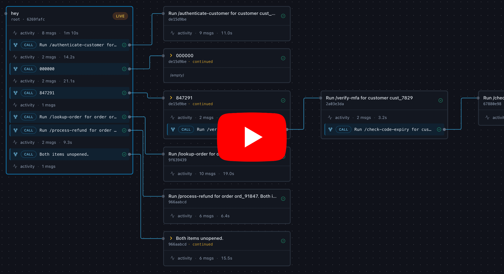

# unwind

Inspect Claude Code sessions, callstack call trees, and subagents.

Run `unwind serve` in any project folder; a browser tab opens showing every Claude Code session that's run there, the conversation for each one, and — when the [callstack](https://github.com/unwind-labs/callstack) plugin's `/call` skill is used — the call hierarchy between sessions and any spawned subagents.

[](https://www.youtube.com/watch?v=MkNRVCShII8)

## Install

```bash
pip install unwind-labs
```

(PyPI distribution name is `unwind-labs`; the installed command is `unwind` and the Python import is `unwind`.)

## Web UI

```bash
cd /path/to/your/claude-project
unwind serve
```

A browser tab opens at `http://127.0.0.1:<port>/` with that project's sessions. `Ctrl-C` to stop.

`unwind serve --help` lists flags (custom port, `--all` project picker, `--no-browser`, etc.).

### Keyboard shortcuts

- `←` / `→` — switch between panes
- `↑` / `↓` — select a session or call-tree node
- `Enter` — open the selected node's details
- `Esc` — close details

## CLI inspection

The same data the web UI shows is also available from the CLI. Run any of them with `--help` for full options; most accept `--json` for scripting.

- `unwind project list | show | current | path` — discover known projects and resolve slugs.
- `unwind session list | show | tree` — list sessions in a project, inspect one, or render its call/subagent tree.
- `unwind messages dump | grep` — dump a session's normalized messages (text/json/markdown) or grep them.
- `unwind task tree | list | roots | forks` — explore the unified call+subagent tree, top-level roots, and in-flight forks.

## How it works

unwind reads:

- `~/.claude/projects/<slug>/*.jsonl` — Claude Code's own session logs
- `<project>/.claude/callstack/log/` — `/call` invocation reports written by the [callstack](https://github.com/unwind-labs/callstack) plugin

…and renders them in a live-updating web UI (or prints them via the CLI). Loopback only (`127.0.0.1`).

## License
[MIT](LICENSE)
