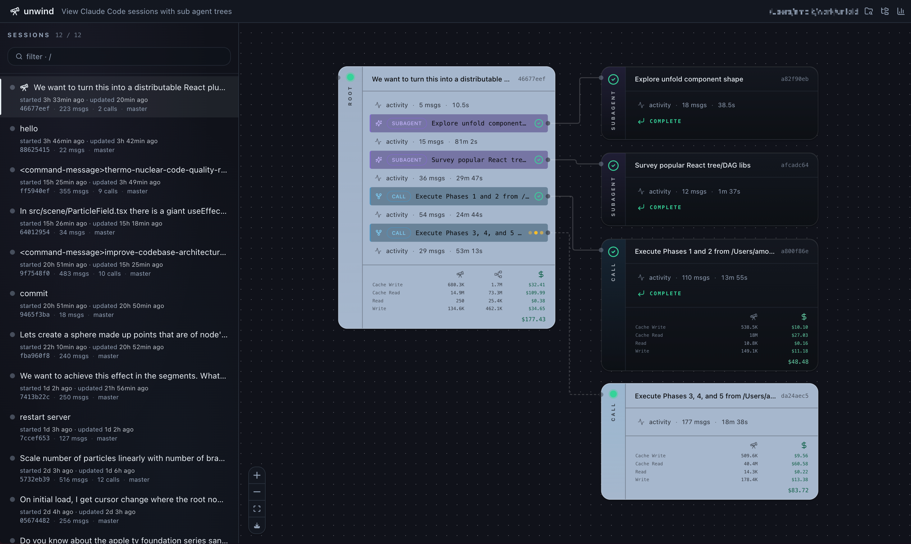
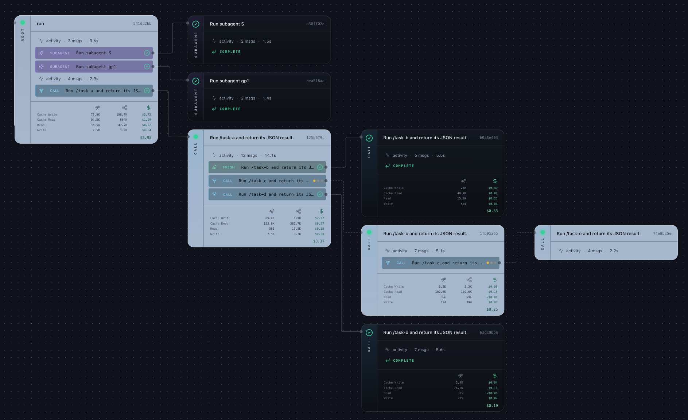
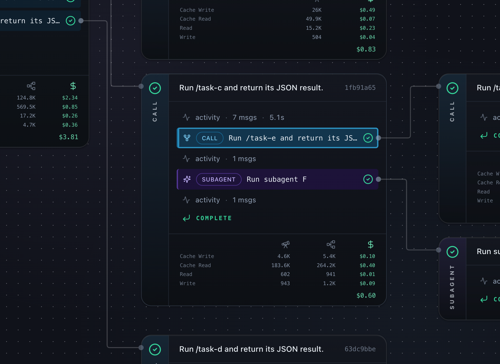
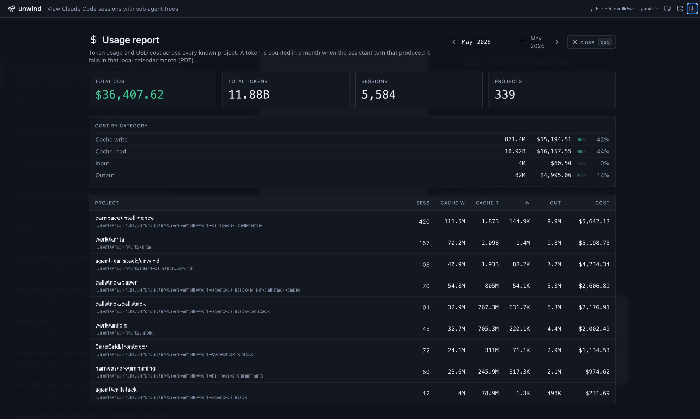
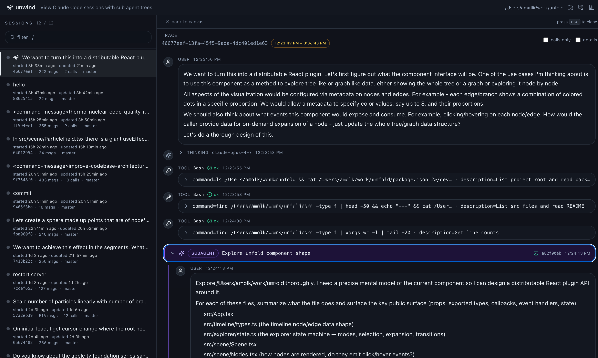

# unwind

See all you Claude Code sessions, where your budget went, which subagent is stuck, and how a multi-agent run actually branched.



unwind reads Claude Code's own session logs and renders every session as a call tree — including subagents and forked/fresh `/call` invocations from the [callstack](https://github.com/unwind-labs/callstack) plugin. No instrumentation, no plugin, no startup hook. Point it at a project that's been running for months and the whole history is there.

## Try it

```bash
pip install unwind-labs
cd /path/to/your/claude-project
unwind serve            # opens a browser at http://127.0.0.1:<port>
```

`Ctrl-C` to stop. `unwind serve --help` for flags (custom port, `--all` project picker, `--no-browser`).

## What unwind is *not*

- Not a profiler or APM. No live instrumentation, no hooks.
- Everything stays local. Does not send data anywhere.
- Doesn't modify Claude Code.

## How it works

unwind reads two sources, both already on your machine:

- `~/.claude/projects/<slug>/*.jsonl` — Claude Code's own session logs (source of truth for conversations, tool calls, and token usage).
- `<project>/.claude/callstack/log/` — `/call` invocation reports written by the [callstack](https://github.com/unwind-labs/callstack) plugin (source of truth for nested `/call` trees).

It joins these into a unified call tree, prices each turn at the model that produced it, and serves the result over a local HTTP port.

<table>
  <tr>
    <td width="340"></td>
    <td><b>The whole multi-agent run as one tree.</b> Subagents, <code>/call</code> with forked context, and <code>/call</code> with fresh context — nested to any depth. Click any node to read the conversation it had, including thinking blocks.</td>
  </tr>
  <tr>
    <td><b>Live status across the tree.</b> Session cards light up on the agent currently working; anything paused waiting on you turns amber back to the root. Glance to know if it's stuck or just busy.</td>
    <td width="340"></td>
  </tr>
  <tr>
    <td width="340"></td>
    <td><b>Cost on every session card.</b> USD spent on each session and on its whole subtree, priced per turn at the model that produced it. When a run blows the budget, point at the branch that did it.</td>
  </tr>
  <tr>
    <td><b>Cross-project monthly rollup.</b> <code>unwind usage report --month 2026-05</code> (or the Reports view) totals tokens + USD across every project. Answer "am I going to overshoot my month?" in one command.</td>
    <td width="340"></td>
  </tr>
  <tr>
    <td width="340"></td>
    <td><b>Zoom into every session.</b> Investigate any agent session quickly, including those stuck or errored out.</td>
  </tr>
</table>

## CLI

The same data the web UI shows is also available from the CLI. Run any of them with `--help` for full options; most accept `--json` for scripting.

| Command | Subcommands |
|---|---|
| `unwind project` | `list`, `show`, `current`, `path` — discover known projects and resolve slugs |
| `unwind session` | `list`, `show`, `tree` — list sessions in a project, inspect one, or render its call/subagent tree |
| `unwind messages` | `dump`, `grep` — dump a session's normalized messages (text/json/markdown) or grep them |
| `unwind task` | `tree`, `list`, `roots`, `forks` — explore the unified call+subagent tree, top-level roots, and in-flight forks |

### Let Claude Code introspect its own runs

Because every command speaks `--json`, Claude Code can call `unwind` as a tool against its own logs. Ask it things like *"use unwind CLI to summarize what the last subagent did,"* *"which branch of yesterday's session cost the most, use unwind CLI"* or *"find the earlier turn where we solved this same bug"* — and let it `unwind messages grep` / `unwind task tree --json` its way to the answer instead of replaying from memory.

## Keyboard shortcuts

- `←` / `→` — switch between panes
- `↑` / `↓` — select a session or call-tree node
- `Enter` — open the selected node's details
- `Esc` — close details

## Optional dependencies

Canvas PNG export uses ImageMagick to stitch large trees. If `magick` isn't on `PATH`, single-tile exports still work; only oversized trees (a single dimension above ~16k px) require it. Install with `brew install imagemagick` (macOS) or `apt-get install imagemagick` (Debian/Ubuntu).

## License

[MIT](LICENSE)
